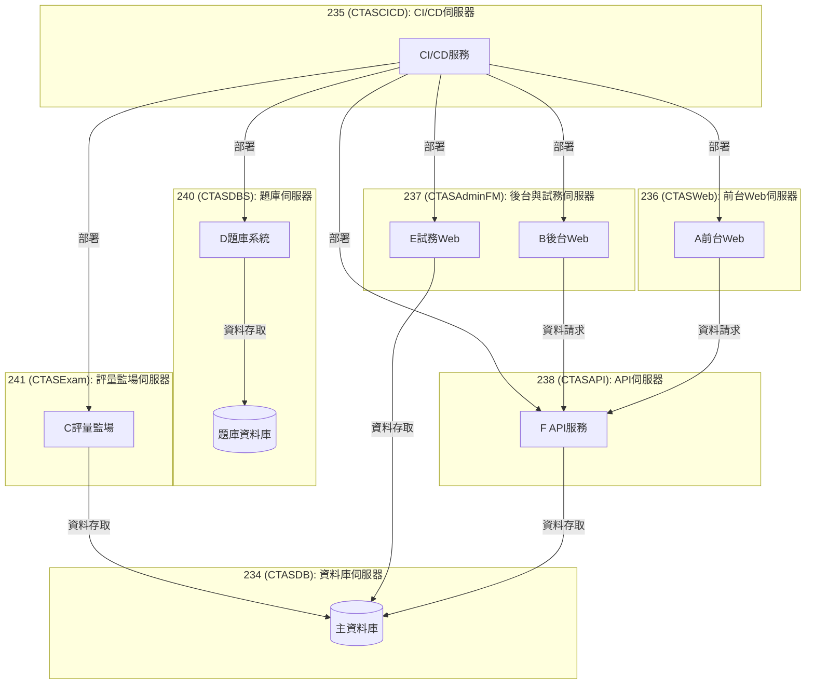

# 機器與專案規劃(暫定)

## 伺服器對照表

- **234 (CTASDB)**：資料庫伺服器，包含題庫以外的系統資料庫
- **235 (CTASCICD)**：CI/CD伺服器
- **236 (CTASWeb)**：前台Web伺服器
- **237 (CTASAdminFM)**：後台與試務Web伺服器
- **238 (CTASAPI)**：API伺服器
- **240 (CTASDBS)**：題庫系統與題庫資料庫伺服器
- **241 (CTASExam)**：評量監場伺服器

## 專案組成

系統由以下6個主要部分組成：

- **(A)前台(宇聖)**：純Web專案，使用者介面，從API Server獲取資料
- **(B)後台(宇聖)**：純Web專案，管理介面，從API Server獲取資料
- **(C)評量監場(書緯)**：監控與管理評量進行的系統
- **(D)題庫(錦蔚)**：題目儲存與管理系統
- **(E)試務(明融)**：考試相關行政管理系統
- **(F)API(意如)**：共用API資料端，提供前台後台等系統資料

## 伺服器配置

- **234 (CTASDB)**：資料庫伺服器，包含除題庫外所有系統的資料庫
- **235 (CTASCICD)**：CI/CD伺服器，負責持續整合與部署
- **236 (CTASWeb)**：前台Web應用伺服器，部署A前台Web應用
- **237 (CTASAdminFM)**：後台與試務Web應用伺服器，部署：
    - B後台Web應用
    - E試務Web應用
- **238 (CTASAPI)**：API伺服器，部署F API應用，為前台與後台提供資料服務
- **240 (CTASDBS)**：題庫專用伺服器，包含：
    - D題庫系統
    - 題庫專用資料庫
- **241 (CTASExam)**：評量監場伺服器，部署C評量監場系統

## 系統架構說明

- D題庫系統有自己的專用資料庫，位於240 (CTASDBS)伺服器；其他系統資料庫放在234 (CTASDB)伺服器上
- A前台和B後台是兩個純Web專案，原本就規畫各自長兩個專案**(跟檔管硬把一個Web切成兩個專案的意義不一樣...)**，資料存取則都打API拿，在238 (**CTASAPI**)那台，遵循前後端分離架構。
- C評量監場、E試務是否也要這樣統一打238的API可以討論。

## 系統架構圖

